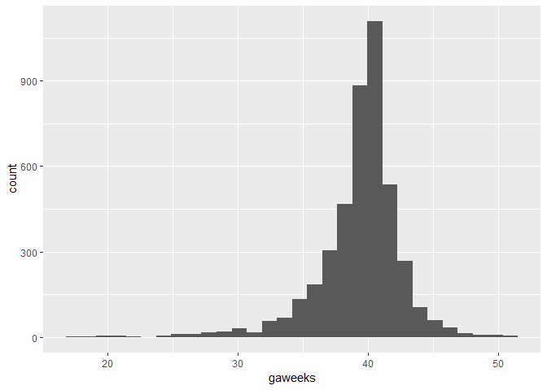
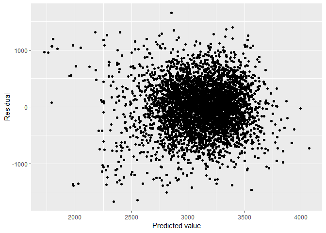
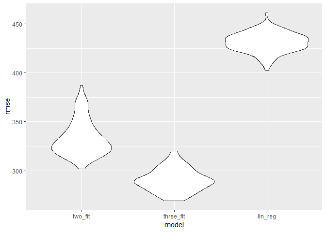

Homework 6
================
Jyoti Ankam
November 25, 2018

Installing the required libraries

``` r
library(tidyverse)
library(modelr)
```

Problem 1 Reading in the dataset using read\_csv. We will now create a city\_with\_state variable (e.g. “Baltimore, MD”), and a binary variable showing if the homicide was solved. Additionally, we will also remove the follwing states - Phoenix, AZ; Dallas, TX; and Kansas City, MO as these states do not report the victim's races and also Tulsa, AL as this seems to be an error in data entry.

Next we will modify victim\_race such that it has the categories white and non-white, making victim\_age numeric and making white the reference category.

``` r
hom_df = read_csv("https://raw.githubusercontent.com/washingtonpost/data-homicides/master/homicide-data.csv", col_names = TRUE) %>% 
  mutate(city_with_state = str_c(city, ",", " ", state),
         solved = if_else(disposition == "Closed by arrest", "resolved", "unresolved"),
         solved = fct_relevel(solved, "unresolved"),
         victim_race = tolower(victim_race),
         colpsd_victim_race = fct_collapse(victim_race, "non-white" = c("asian","black", "hispanic", "other", "unknown")),
         colpsd_victim_race = fct_relevel(colpsd_victim_race, "white"),
         victim_age = as.numeric(victim_age)) %>% 
  filter(!(city_with_state %in% c("Phoenix, AZ", "Dallas, TX", "Kansas City, MO", "Tulsa, AL")))
```

    ## Warning in evalq(as.numeric(victim_age), <environment>): NAs introduced by
    ## coercion

Let us now use the glm function to fit a logistic regression for the city of Baltimore, M.D. wherein the outcome is dichotomous (resolved vs unresolved) and the predictors are victim age, sex and race. Additionally, let us obtain the estimate and confidence interval of the adjusted odds ratio for solving homicides comparing non-white victims to white victims keeping all the other variables constant.

``` r
balt_df = hom_df %>% 
  filter(city_with_state == "Baltimore, MD")

logis_balt = glm(solved ~ victim_age + victim_sex + colpsd_victim_race, data = balt_df, family = binomial())

logis_balt %>% broom::tidy() %>% 
  janitor::clean_names() %>% 
  mutate(OR = exp(estimate),
         lower_95_ci = exp(estimate - (1.96 * std_error)),
         upper_95_ci = exp(estimate + (1.96 * std_error))) %>% 
  filter(term == "colpsd_victim_racenon-white") %>% 
  select(OR, lower_95_ci, upper_95_ci) %>% 
  knitr::kable(digits = 3)
```

|     OR|  lower\_95\_ci|  upper\_95\_ci|
|------:|--------------:|--------------:|
|  0.441|          0.313|           0.62|

From the above, we know the odds of solving homicides in non-white victims vs white victims is 0.441 after adjusting for sex and age. We are also 95% confident that the odss lie between 0.31 and 0.62.

Next, we will run the glm function for each one of the cities and extract the adjusted odds ratio and CI for solving homicides comparing non-white victims to white victims.

``` r
logis_cities = hom_df %>% 
  
  # variable selection
  select(city_with_state, solved, victim_age, victim_sex, colpsd_victim_race) %>%
  
  # Iterations
  group_by(city_with_state) %>% 
  nest() %>% 
  
  # Using maps for iterating the tidy and glm functions
  mutate(models = map(.x = data, ~ glm(solved ~ victim_sex + colpsd_victim_race + victim_age, family = binomial, data = .x)),
  models = map(models, broom::tidy)) %>% 
  select(-data) %>% unnest() %>% 
  filter(term == "colpsd_victim_racenon-white") %>% 
  mutate(OR = exp(estimate),
  # Calculating the 95% confidence intervals
         lower_95_ci = exp(estimate - (1.96*std.error)),
         upper_95_ci = exp(estimate + (1.96*std.error))) %>% 
  select(city_with_state, OR, lower_95_ci, upper_95_ci) %>% 
  
  # Organizing cities from the lowest to the highest as per estimated ORs 
  mutate(city_with_state = reorder(city_with_state, OR))
```

Let us create a plot showing the estimated ORs and CIs for each city.

``` r
ggplot(logis_cities, aes(x = city_with_state, y = OR)) + 
  geom_point() + 
  geom_errorbar(aes(ymin = lower_95_ci, ymax = upper_95_ci)) + 
  coord_flip() +
  geom_hline(aes(yintercept = 1.00), linetype = "dashed", color = "blue") + 
  labs(
    y = "OR (95% Confidence interval)",
    x = "City, State"
  )
```


With the exceptions of Birmingham, Tampa, Durham, we see that in almost all of the cities the odds ratio lies below 1.0. This indicates that in almost all of the cities, the odds of solving a homicide for non-whites is less than that of the white category, after cotrolling for sex and age. However, since the confidence intervals for almost about half of those include the null value of 1, we can conclude that these results are not statistically significant.

Problem 2

``` r
child_df = read_csv("./data/birthweight.csv") %>% 
  mutate(babysex = as.factor(babysex),
         frace = as.factor(frace),
         mrace = as.factor(mrace),
         malform = as.factor(malform))

# let us now check if there are missing variables in any of the observations
filter_all(child_df, any_vars(is.na(.)))
```

    ## # A tibble: 0 x 20
    ## # ... with 20 variables: babysex <fct>, bhead <int>, blength <int>,
    ## #   bwt <int>, delwt <int>, fincome <int>, frace <fct>, gaweeks <dbl>,
    ## #   malform <fct>, menarche <int>, mheight <int>, momage <int>,
    ## #   mrace <fct>, parity <int>, pnumlbw <int>, pnumsga <int>, ppbmi <dbl>,
    ## #   ppwt <int>, smoken <dbl>, wtgain <int>

``` r
sum(is.na(hom_df))
```

    ## [1] 635

We find no missing obervations for the variables.

The hypothesis is that the gestational age in weeks is associated with baby's birthweight. We will adjust for baby's sex, mother age, sex, race, weight gain and average number of cigarettes smoked daily during pregnancy to test this hypothesis. Since the outcome of interest is continuous, we can do linear regression.

Let us now look at the distribution of the two variables - gestational age in weeks and birthweight and plot a graph showing the correlation.

``` r
ggplot(child_df, aes(x = gaweeks)) + geom_histogram()
```



``` r
ggplot(child_df, aes(x = bwt)) + geom_histogram()
```


``` r
ggplot(child_df, aes(x = gaweeks, y = bwt)) + geom_point() + geom_smooth(method = lm)
```


As we can see from the plots - birthweight seems to be normally distributed while there is a slight left skew for the gestational age in weeks plot.

``` r
lin_reg = lm(bwt ~ gaweeks + babysex + momage + mrace  + wtgain + smoken, data = child_df)

lin_reg %>% 
  broom::tidy()
```

    ## # A tibble: 9 x 5
    ##   term        estimate std.error statistic   p.value
    ##   <chr>          <dbl>     <dbl>     <dbl>     <dbl>
    ## 1 (Intercept)   868.      92.4        9.40 8.99e- 21
    ## 2 gaweeks        54.9      2.14      25.6  7.67e-135
    ## 3 babysex2      -86.0     13.1       -6.55 6.61e- 11
    ## 4 momage          4.82     1.83       2.63 8.51e-  3
    ## 5 mrace2       -276.      15.1      -18.3  5.92e- 72
    ## 6 mrace3       -199.      67.0       -2.97 3.00e-  3
    ## 7 mrace4       -168.      29.6       -5.68 1.42e-  8
    ## 8 wtgain          9.27     0.610     15.2  6.91e- 51
    ## 9 smoken        -11.4      0.916    -12.4  9.80e- 35

Plotting a model of residuals against fitted values using add\_predictions and add\_residuals

``` r
child_df %>% 
  modelr::add_predictions(lin_reg) %>% 
  modelr::add_residuals(lin_reg) %>% 
  ggplot(aes(x = pred, y = resid)) + geom_point() +
  labs(x = "Predicted value", 
       y = "Residual")
```



Comparing 3 non-nested models:

Let's use cross-validation methods to compare the 3 models below -

``` r
two_fit = lm(bwt ~ blength + gaweeks, data = child_df)

three_fit = lm(bwt ~ bhead * blength *babysex, data = child_df)
```

Cross validation -

``` r
set.seed(1)

cross_df =
  crossv_mc(child_df, 100) %>% 
  mutate(train = map(train, as_tibble),
         test = map(test, as_tibble))
```

``` r
cross_val = cross_df %>% 
  mutate(two_fit = map(train, ~ lm(bwt ~ blength + gaweeks, data = .x)),
         three_fit = map(train, ~ lm(bwt ~ bhead * blength *babysex, data = .x)),
         lin_reg = map(train, ~ lm(bwt ~ gaweeks + babysex + momage + mrace  + wtgain + smoken, data = .x))) %>% 
  mutate(rmse_two_fit = map2_dbl(two_fit, test, ~ rmse(model = .x, data = .y)),
         rmse_three_fit = map2_dbl(three_fit, test, ~ rmse(model = .x, data = .y)),
         rmse_lin_reg = map2_dbl(lin_reg, test, ~ rmse(model = .x, data = .y)))
```

``` r
cross_val %>% 
  select(starts_with("rmse")) %>% 
  gather(key = model, value = rmse) %>% 
   mutate(model = str_replace(model, "rmse_", ""),
         model = fct_inorder(model)) %>% 
  ggplot(aes(x = model, y = rmse)) + geom_violin()
```



``` r
cross_val %>% 
  select(starts_with("rmse")) %>% 
  gather(key = model, value = rmse) %>% 
  group_by(model) %>% 
  summarize(mean_rmse = mean(rmse)) %>% 
  arrange(mean_rmse) %>% 
  knitr::kable(digits = 3)
```

| model            |  mean\_rmse|
|:-----------------|-----------:|
| rmse\_three\_fit |     290.156|
| rmse\_two\_fit   |     333.455|
| rmse\_lin\_reg   |     431.180|

From the above code chunk, we get the lowest root mean square error for model three fit (290.156) which has three terms with interactions. Hence, we can conclude that it is a better fitting model
